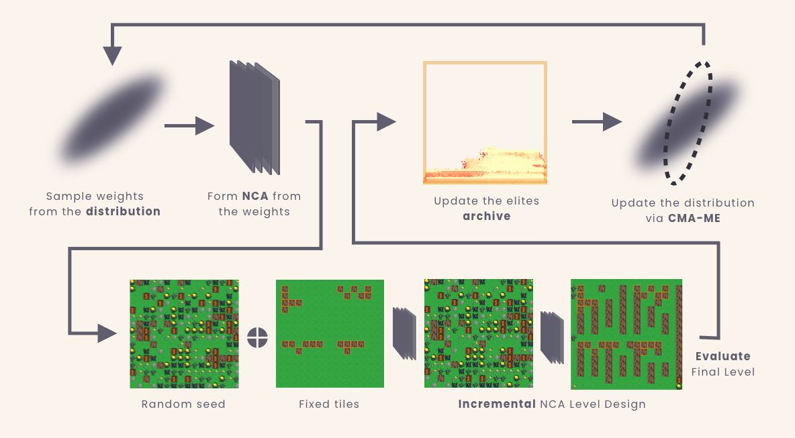
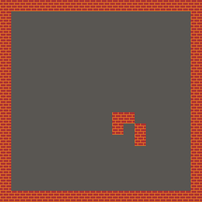
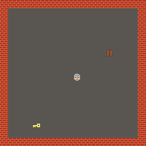
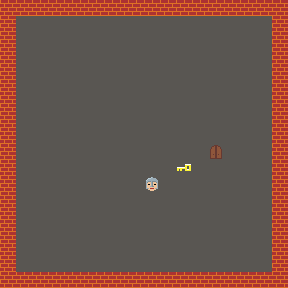

## :video_game: About
Platform for experimentation with generating game levels via archive of Neural Cellular Automata trained using CMA-ME QD algorithm. The `README`
is structured into three main sections: environment setup, evolve your level generator archive, results reproduction. 

In the below sections, we assume you are familiar with the terminology used in our work. If not, please first refer to the main [readme page](https://github.com/Interactive-NCA) of our project.

One of the main functionalities of this codebase is to be able to evolve archive of NCA models while being able to differ many hyper-parameters. The main training loop is outlined in the figure below.



## :snake: Conda Environment Setup
We use `conda` as our default virtual environment. First, create conda environment and install `pip`:

```bash
conda create --name pcgnca python=3.10
conda activate pcgnca
conda install pip
```

Then, install rest of the packages via `pip`:

```bash
python3.10 -m pip install -r requirements.txt
```

## :bug: Evolve your own game level generators
To evolve your own archive of game level generators, you first need to setup the experiment in [settings](settings/). This folder includes 4 subfolders where each includes readme providing the neccessary details. 
The high level summary is:

- [core experiment settings](settings/experiment/settings.json): here you can specify hyper-parameters such as number of NCA growth steps, batch size etc. 
- [fixed tile settings](settings/fixed_tiles/): here, the fixed tiles archives for each games are stored. Each game subfolder includes details how to generate these archives. 
- [games settings](settings/games/): settings of a given game such as grid dimension.

You can skip the slurm settings. You can also go first with the default settings. For that, we first need to generate the archive with fixed walls as follows:

```bash
python3 cli.py --gen-fixed-seeds --fixedgen-game "zelda" --fixedgen-nseeds 1000 --fixedgen-difficulty "easy"
```

Then, we can train the archive as follows:

```bash
python3 cli.py --train --n_cores 8 --n_generations 10 --save_freq 2
```

The number of training iterations (`--n_generations`) is set to 10 which should take around 3 to 5 min to train the archive. If you want archive with models that are actually working properly, you need 
to run the training for at least 3000 generations, which takes around 4 to 5 hours. You can use our template for a slurm job:

```bash
#!/bin/bash

#SBATCH --job-name=PCGNCA-EXPERIMENT-X
#SBATCH --output=experiments/ExperimentId-X/slurm.out
#SBATCH --cpus-per-task=32
#SBATCH --time=08:00:00
#SBATCH --partition=red,brown
#SBATCH --mail-user=user@uni.edu
#SBATCH --mail-type=BEGIN,FAIL,END
#SBATCH --exclude cn8

echo "Running on $(hostname)"

module load Anaconda3
source /home/user/.bashrc
conda activate pcgnca

python3 cli.py --train --n_cores 32 --n_generations 3000 --save_freq 100
```

You can the evaluate the archive's performance according to the instrustions specified in the below subsection (reproduce resulsts > archive evaluation). The follow up subsection then includes 
information about to translate the raw data into a nice markdown overview.

## :microscope: Reproduce the experiments
The reproduction of our experiments can be done in for subsequent steps: fixed tiles archive generation, archive training, archive evaluation, results summarisation. 
All these steps are documented in detail below.

### Fixed tiles archive generation
To generate archives with fixed tiles used in our work, run the following command:

```bash
# walls
python3 cli.py --gen-fixed-seeds --fixedgen-game "zelda" --fixedgen-nseeds 1000 --fixedgen-difficulty "easy"
# triples
python3 cli.py --gen-fixed-seeds --fixedgen-game "zelda" --fixedgen-nseeds 1000 --fixedgen-difficulty "all_special_random"
# pairs
python3 cli.py --gen-fixed-seeds --fixedgen-game "zelda" --fixedgen-nseeds 1000 --fixedgen-difficulty "two_special_random"
# singles
python3 cli.py --gen-fixed-seeds --fixedgen-game "zelda" --fixedgen-nseeds 1000 --fixedgen-difficulty "one_special_random"
# mixed
python3 cli.py --gen-fixed-seeds --fixedgen-game "zelda" --fixedgen-nseeds 1000 --fixedgen-difficulty "mixed"
```

You can then checkout the results in the [zelda fixed tiles folder](settings/fixed_tiles/zelda/) where each type of fixed tiles also has a corresponding `gif` showcasing ten percent of the fixed tiles archive sampled randomly. Below, you can see example of archive for fixed `Walls`, `Triples` and `Mixed`.

| Walls            |   Triples        |   Mixed          |
|:----------------:|:----------------:|:----------------:|
|  |  | 

### Archive training

First, copy the settings of the experiments to be reproduced to the experiments folder:

```bash
cp -r reproduce/* experiments/
```

Then, to train the ith experiment `locally`, you can run the following command (example for the baseline archive):

```bash
python3 cli.py --train --expid 1 --n_cores 32 --n_generations 3000 --save_freq 100
```

where:
- `--expid`: the id of the experiment you want to train, our work included baseline (`1`), walls (`2`), triples (`3`), pairs (`4`), singles (`5`) and mixed (`6`).
- `--n_cores`: how many cpu cores you want to use
- `--n_generations`: how many training iterations you want to run
- `--save_freq`: how often do you want to save the state of the archive

If you want to run the experiment on slurm cluster, then you can use the `job` template specified below:

```bash
#!/bin/bash

#SBATCH --job-name=PCGNCA-EXPERIMENT-X
#SBATCH --output=experiments/ExperimentId-X/slurm.out
#SBATCH --cpus-per-task=32
#SBATCH --time=08:00:00
#SBATCH --partition=red,brown
#SBATCH --mail-user=user@uni.edu
#SBATCH --mail-type=BEGIN,FAIL,END
#SBATCH --exclude cn8

echo "Running on $(hostname)"

module load Anaconda3
source /home/user/.bashrc
conda activate pcgnca

python3 cli.py --train --expid 1 --n_cores 32 --n_generations 3000 --save_freq 100
```

### Archive evaluation
To evaluate the archives `locally`, you can run (example for the baseline):

```bash
python3 cli.py --evaluate --expid 1 --n_cores 32 --fxd_til "easy" --fxd_til_size 1000 --n_evals 10 --eval_batch_size 10
```

where:
- `--fxd_til`: type of fixed tiles you want to evaluate the archive on
- `--fxd_til_size`: size of the fixed tiles archive
- `--n_evals`: number of evaluations to run
- `--eval_batch_size`: size of the batch in each evaluation based on which BCs and objective of each model should be computed

For cluster, you can again use the template:

```bash
#!/bin/bash

#SBATCH --job-name=PCGNCA-EXPERIMENT-X
#SBATCH --output=experiments/ExperimentId-X/slurm.out
#SBATCH --cpus-per-task=32
#SBATCH --time=08:00:00
#SBATCH --partition=red,brown
#SBATCH --mail-user=user@uni.edu
#SBATCH --mail-type=BEGIN,FAIL,END
#SBATCH --exclude cn8

echo "Running on $(hostname)"

module load Anaconda3
source /home/user/.bashrc
conda activate pcgnca

python3 cli.py --evaluate --expid 1 --n_cores 32 --fxd_til "easy" --fxd_til_size 1000 --n_evals 10 --eval_batch_size 10
```

### Summarising results
Once the results are computed, you can use the summarisation script that puts them in a nice markdown overiew. Assuming we have trained all our experiments and 
evaluated them against fixed walls (`easy`) with the archive size of fixed tiles being 1000, number of evalutions was 10 and evaluation batch size was 10 as well:

```bash
python3 cli.py --summarise "1,2,3,4,5,6" --fxd_til "easy" --fxd_til_size 1000 --n_evals 10 --eval_batch_size 10
```

You can then view the result in [summaries folder](summaries/). If you are using VS code, you can simply click on the markdown file and then in upper right corner click on
`Open preview to the side`.
